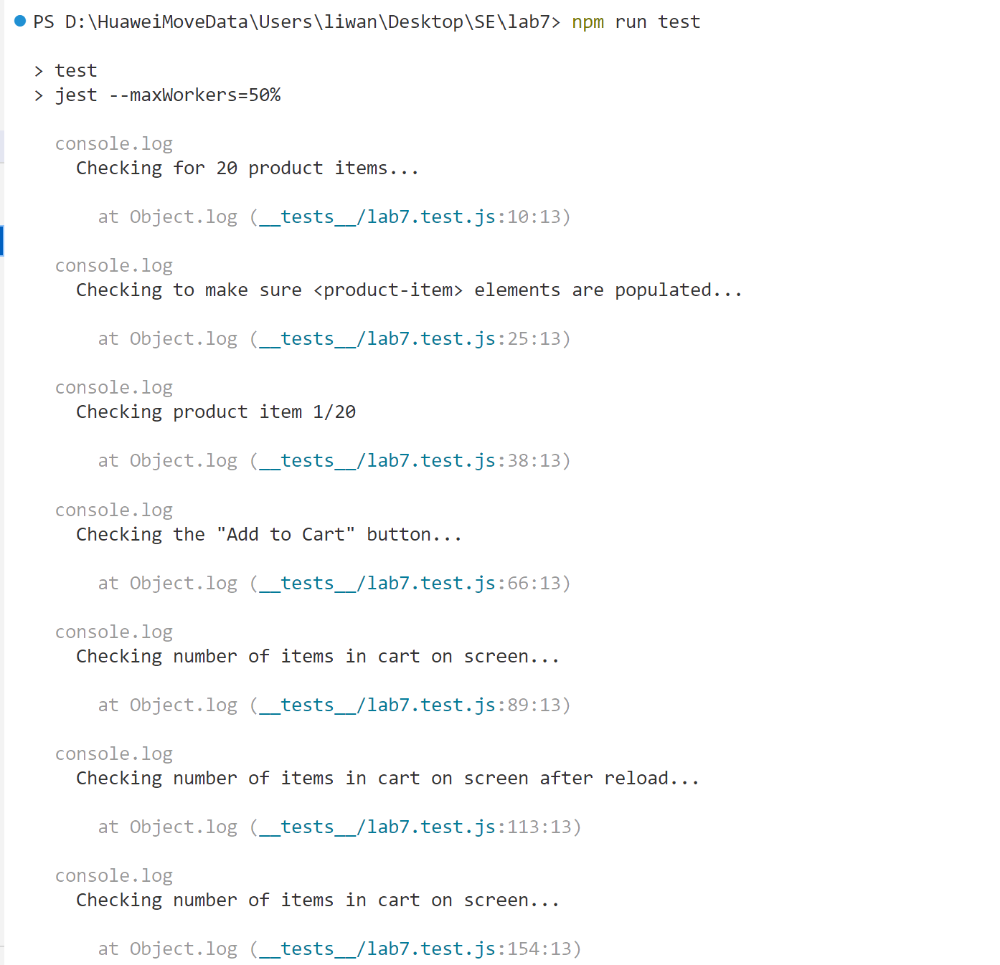
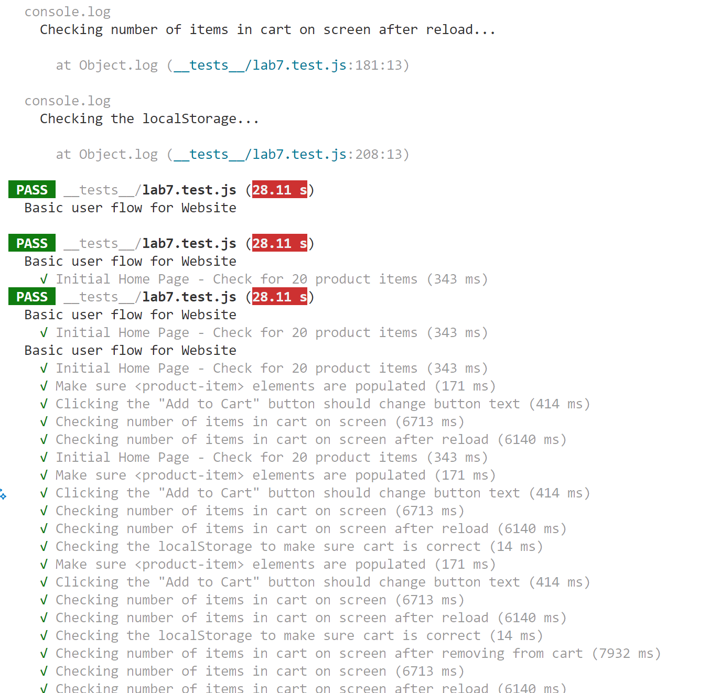
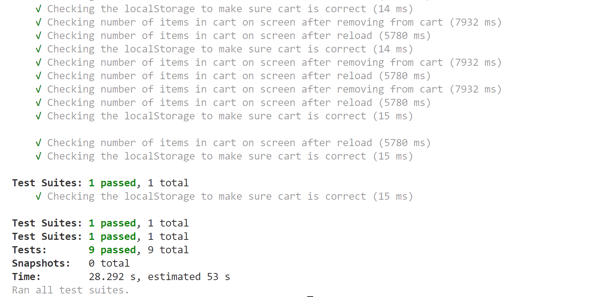

# Lab 7

## Wanting Li

## Check Your Understanding

1. I choose "1. Within a Github action that runs whenever code is pushed ". Because it ensures that tests are run automatically and consistently every time someone pushes code to the repository. This provides immediate feedback on problems it might have, and prevents broken code from being merged into the main branch. Unlike manually testing, it reduces human error and lower the risk of forgetting to test before merging.

2. No

3. Navigation mode simulates the whole process of loading the page from the beginning, which can be used to measure overall performance. Snapshot mode simulates an instant of the current page's DOM, which can be used to test dynamic states.

4. 

- Some pictures do not have a proper size to display, which slow down the loading time. Resize pictures and serve pictures that are appropriately-sized to save cellular data and improve load time.

- <html> element does not have a [lang] attribute. Add a lang attribute on the <html> tag.

- Does not have a <meta name="viewport"> tag with width or initial-scaleNo `<meta name="viewport">` tag found. Add a `<meta name="viewport">` tag to optimize your app for mobile screens.

## Test results for lab7.test.js

